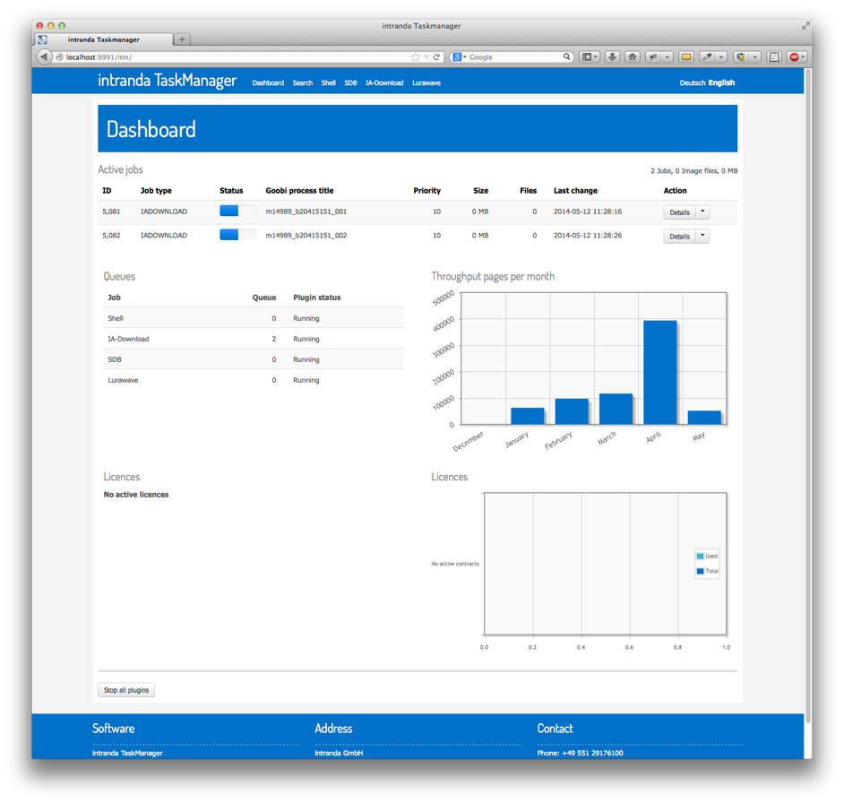

# 3.1. Dashboard

If you open TaskManager as a web application using a web browser, you will initially be shown the dashboard. This gives you an overview of all the main information for each of the job types in use without the need to painstakingly examine the queues for each plugin. 

To begin with, at the top of the dashboard, you will find a list of the first five jobs currently being processed \(active jobs\). Jobs will only be listed if their status corresponds to one of the five shown below:

* PAUSED
* UPLOAD
* DOWNLOAD
* PROCESSING
* STARTED
* WAITINGFORUPLOAD

Above the active jobs table you will find a list of information on all the jobs as a whole. This gives you a rapid overview of the data that still needs to be processed.

The dashboard includes an option to request detailed information on the individual jobs listed. This also allows you to select and modify a particular job, e.g. in order to change its priority level or cancel it.

If you wish to process an individual job, select the corresponding button in the `Action` column to make the required change. A detailed list of the actions that can be performed is given in the section on plugins.

Underneath the list of some active jobs on the dashboard, you will find a table indicating the status of each plugin queue. This also provides an overview of any plugins that may have been stopped, e.g. for maintenance purposes.

The dashboard also gives you an overview of previous jobs. This can be useful for invoicing or purely statistical purposes. It includes a list of the number of jobs completed in each month. In the case of OCR jobs, the application displays both a table and a diagram showing the number of pages from your available total that have already been used and the number still remaining. TaskManager interacts directly with the intranda Licence Server to show you precisely how many A4 pages have been used, thus giving you maximum transparency when assessing your progress.

As administrator, you will find a button at the bottom of the dashboard that allows you to stop \(i.e. pause\) all plugins. If you select this button, all jobs for all active plugins will be paused as soon as possible. Please note that for some plugins this can take a few minutes. You should not close down TaskManager \(e.g. to carry out maintenance\) until the status of all plugins is shown as stopped.

