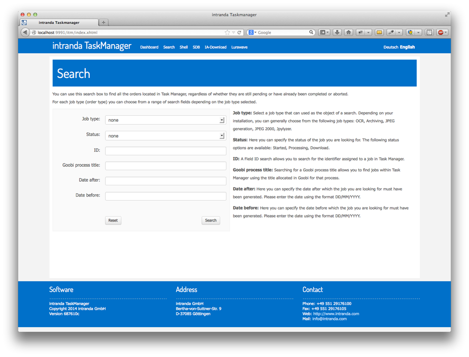

# 3.2. Suche

Für den Fall, dass ein bestimmter Job gesucht und auf seine Verarbeitung hin überprüft werden soll, bietet der TaskManager eine detaillierte Suche an. Diese erlaubt, dass granular nach individuellen Feldern gesucht werden kann. So ist es z.B. möglich, mehrere Suchparameter – wie beispielsweise den `Status`, `ID` und `Titel` – miteinander zu kombinieren, um das gewünschte Trefferset zu erhalten.

Zur einfacheren Bedienung verfügt die Suche unmittelbar in der Nutzeroberfläche über eine Hilfe, die während der Eingabe von Suchparametern innerhalb des Formulars Unterstützung bietet.

