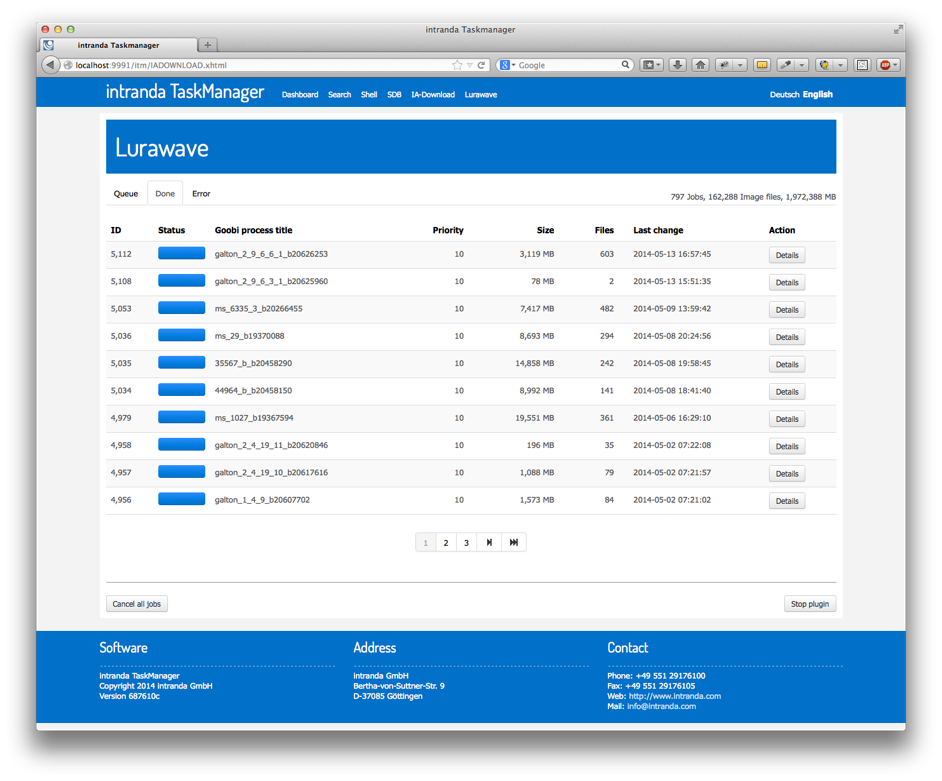
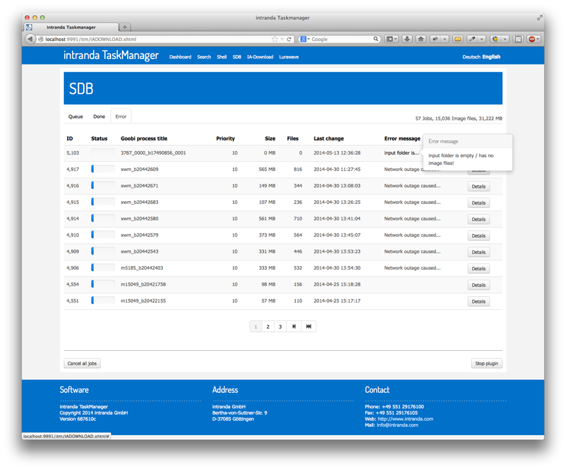
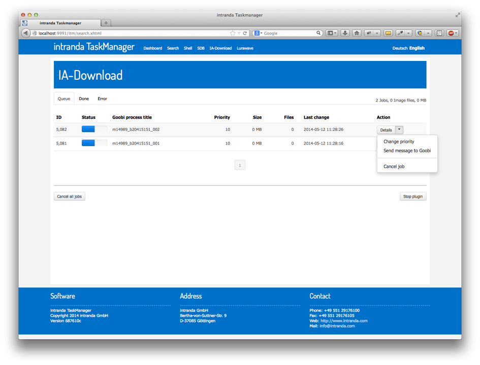
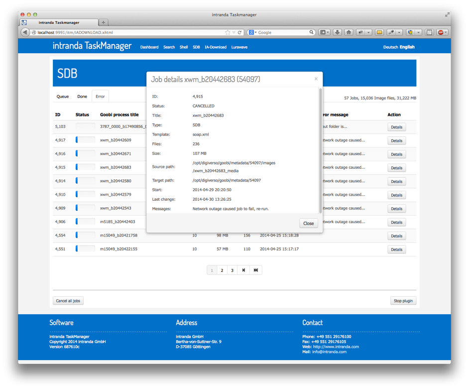
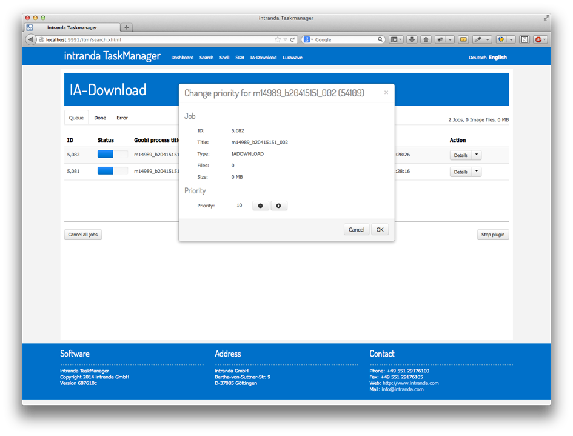
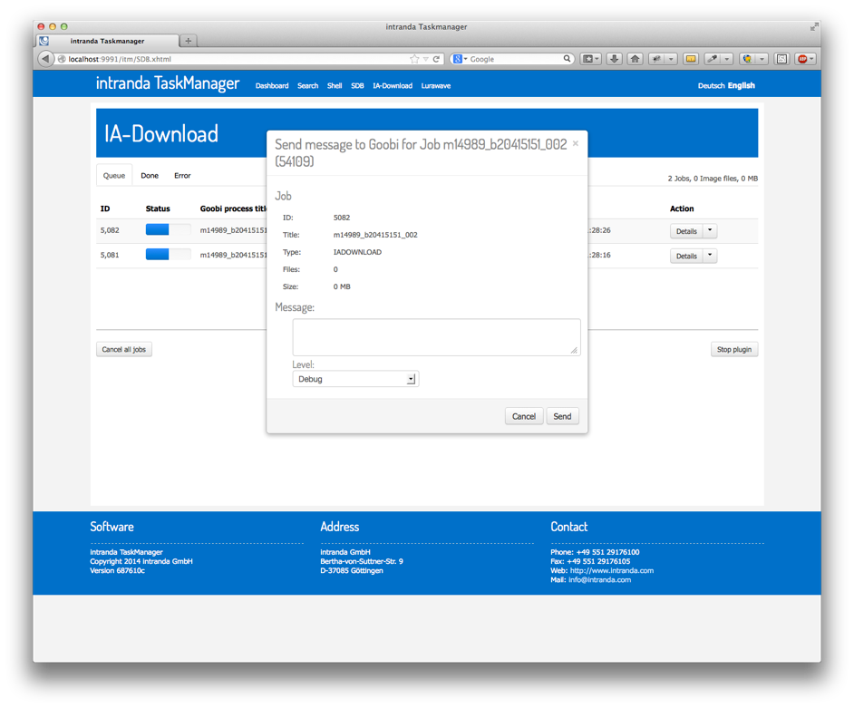

# 3.3. Plugin sections

TaskManager contains a separate menu item in the menu bar for each installed plugin. Selecting a plugin from the menu allows you to list all the jobs for that plugin by their current status. The results will tell you whether a job is still in the queue, has been completed or has been cancelled due to an error.

Above the table to the right you will find statistical information on all the jobs in the currently selected tab. This will tell you, for example, the number of files and the volume of data.

There are two additional buttons underneath the table that allow you to pause the current plugin or cancel all current jobs. If you cancel a job, the result is permanent and no further processing will take place. By contrast, the 'Stop plugin' button merely brings about a temporary pause; processing of the job will continue when you restart the plugin.

## Active jobs in the queue

The `Queue`  tab lists all active jobs for the selected plugin. Jobs with the following status are regarded as active:

* PAUSED
* UPLOAD
* DOWNLOAD
* PROCESSING
* STARTED
* WAITINGFORUPLOAD

## Completed jobs

The Done tab lists all jobs for the selected plugin that have already been `completed`, i.e. with the following status:

* DONE

## Unsuccessful jobs

The Error tab lists all jobs for the selected plugin that have generated a processing error, i.e. jobs with the following status:

* ERROR
* CANCELLED

Unlike the other tabs, you can see in the table which errors occurred when performing a job. Selecting the abbreviated error message will open a pop-up containing the full message.

## Job actions

For each job you can select a number of actions depending which tab is open and showing the current status of those jobs. These actions are listed and explained below. The range of actions available may vary depending on the job type.

### **Action: Details**

The `Details` action opens a pop-up containing full details of the selected job, e.g. various identifiers, directory information, priority, file size and the job’s ID within Goobi.

### **Action: Change priority**

The `Change priority` action opens a pop-up that allows you to change the processing priority. You can modify the default priority using the plus and minus buttons. In turn, this will amend the order in which jobs are processed in the queue. Please notice that a `higher number` means here a `higher priority`

### **Action: Send message to Goobi**

The action `Send message to Goobi` opens a pop-up that allows you to send a message to Goobi. Depending on the type of message selected, it will be shown in the process log and is therefore visible to all Goobi users working with that particular workflow process.

### **Action: Cancel job**

The action `Cancel job` opens a pop-up that allows you to cancel the selected job. If a job is currently being processed, it may have to wait for internal processing \(e.g. if a copy instruction is being executed\) before the job can be completely cancelled.

